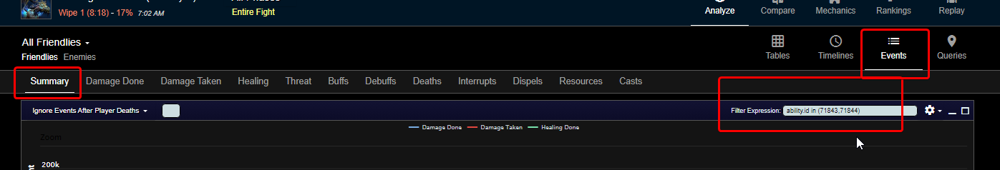

# Nibelung data

 _Discord_: `Discfordge` [_Vivax (Pagle-US)_]  

Public data for Nibelung from round 1 and round 2 of Icecrown Citadel (ICC) PTR  
World of Warcraft: Classic Wrath of the Lich King (WOTLKC)

You can explore it yourself [here](https://github.com/ForgeGit/Nibelung_Stick/blob/main/clean_data_Nibelung_PTR_2023_09_28_h19_m07.csv).

| Class    | Total Logs |
| :------- | ----------:|
| Druid    |        435 |
| Priest   |        148 |
| Warlock  |        123 |
| Mage     |        108 |
| Shaman   |         26 |

Nibelung has two (2) different versions:

- Normal mode Lady Deathwhisper ilvl 264 [(item: 49992)](https://www.wowhead.com/wotlk/item=49992/nibelung)
    - Val'kyr _proc_ [spell: 71843](https://www.wowhead.com/wotlk/spell=71843/summon-valkyr)
    - Summons Val'kyr GUARDIAN [NPC 38391](https://www.wowhead.com/wotlk/npc=38391/valkyr-guardian)
    
- Heroic mode Lady Deathwhisper ilvl 277 [(item: 50648)](https://www.wowhead.com/wotlk/item=50648/nibelung)
    - Val'kyr _proc_ [spell: 71844](https://www.wowhead.com/wotlk/spell=71844/summon-valkyr)
    - Summons Val'kyr GUARDIAN [NPC: 38392](https://www.wowhead.com/wotlk/npc=38392/valkyr-guardian)

You can check for Val'kyr summons on your own logs with the filter expression `ability.id in (71843,71844)` 

  
_You have to enter that and press "Enter", btw_

## Methodology

All the data was collected using the [Warcraft Logs Classic API v2](https://articles.classic.warcraftlogs.com/help/api-documentation) and processed with R v.4.2 (R Development Core Team).

Log IDs for PTR ICC were previously obtained and filtered in a different project: 
- https://github.com/ForgeGit/ICC_PTR

Full data can be found in this same repository: 
- https://github.com/ForgeGit/Nibelung_Stick/blob/main/clean_data_Nibelung_PTR_2023_09_28_h19_m07.csv

## Other analysis and random stuff

- If you have questions, you can contact me on discord: https://discord.gg/wp55kqmyYG (Discord: Discfordge)

- Consider buying me a coffee? :) https://ko-fi.com/forge

- Check other things I have done here: https://github.com/ForgeGit?tab=repositories

